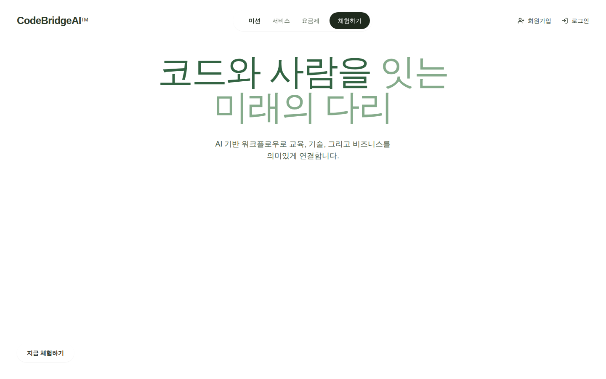
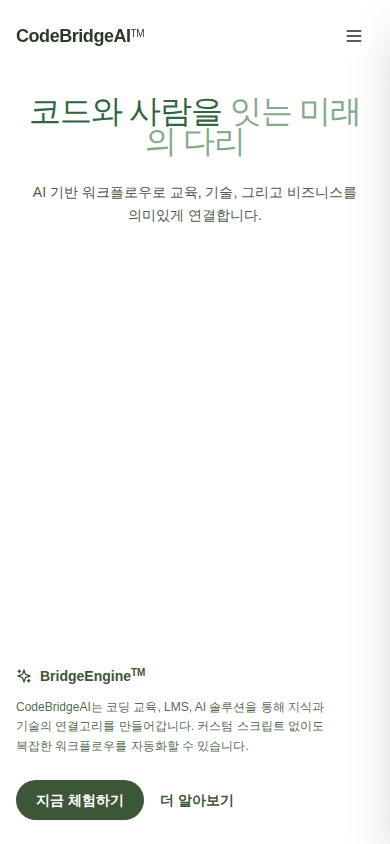

# CodeBridgeAI Homepage

코드와 사람을 잇는 다리, **CodeBridgeAI** 공식 홈페이지.  
코딩 교육, LMS, 디지털사이니지, AI 솔루션을 통해 지식과 기술을 연결합니다.

---

## 미리보기

### 데스크톱 (1440 × 900)


### 모바일 (390 × 844)


---

## 기술 스택

| 분류 | 기술 |
|------|------|
| 번들러 | [Vite 5](https://vitejs.dev/) |
| UI 라이브러리 | [React 18](https://react.dev/) |
| 언어 | TypeScript |
| 스타일링 | [Tailwind CSS 3.4](https://tailwindcss.com/) |
| 아이콘 | [lucide-react](https://lucide.dev/) |
| 애니메이션 | CSS transitions (Framer Motion 미사용) |

---

## 주요 기능

- **BoomerangVideoBg** — CloudFront CDN 영상을 캔버스에 캡처 후 30fps 앞뒤 루프 재생
- **반응형 네비게이션** — 데스크톱 pill nav / 모바일 슬라이드 드로어 (CSS cubic-bezier)
- **SEO 최적화**
  - `<title>`, `<meta description>`, `<meta keywords>`
  - Open Graph (og:title, og:description, og:image, og:locale)
  - Twitter Card (summary_large_image)
  - JSON-LD `Organization` 구조화 데이터
  - `robots.txt` Allow + Sitemap 지시어

---

## 설치 및 실행

```bash
# 의존성 설치
npm install

# 개발 서버 실행 (http://localhost:5173)
npm run dev

# 프로덕션 빌드
npm run build

# 빌드 결과 미리보기
npm run preview
```

---

## 프로젝트 구조

```
codebridgeai-homepage/
├── index.html                  # SEO 메타 + 폰트 프리로드 + JSON-LD
├── vite.config.ts
├── tailwind.config.js
├── postcss.config.js
├── public/
│   ├── favicon.png
│   ├── robots.txt
│   ├── screenshot-desktop.png
│   └── screenshot-mobile.png
└── src/
    ├── main.tsx                # React 진입점
    ├── index.css               # Tailwind + Neue Haas Grotesk 폰트 스택
    ├── App.tsx                 # 히어로 섹션 전체 (nav, hero copy, CTA)
    └── BoomerangVideoBg.tsx    # 캔버스 기반 보메랑 영상 컴포넌트
```

---

## Docker 배포

```bash
# 이미지 빌드
docker build -t codebridgeai .

# 컨테이너 실행
docker run -p 5000:5000 codebridgeai

# 또는 Docker Compose
docker-compose up --build
```

---

## 연락처

- **웹사이트**: [https://codebridge.ai.kr](https://codebridge.ai.kr)
- **교육 플랫폼**: [https://lms.codebridge.ai.kr](https://lms.codebridge.ai.kr)
- **비즈니스 문의**: [카카오톡 채널](https://pf.kakao.com/_aEFxnn)

---

**CodeBridgeAI** — 코드와 사람을 잇는 다리
